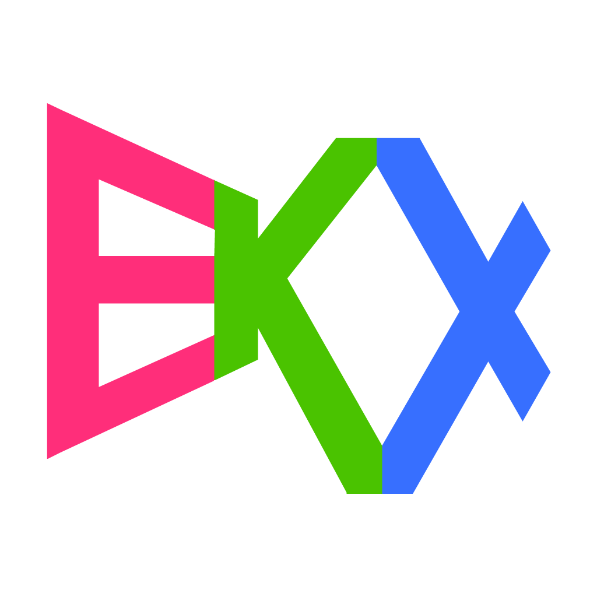

## Toy game engine

## Showcase

- **EKX Demo**
  | [GooglePlay](https://play.google.com/store/apps/details?id=ilj.play.demo)
  | [Web](https://play-ilj.web.app/)
- **Sense of Color**
  | [AppStore](https://apps.apple.com/us/app/sense-of-color/id1435111697)
  | [GooglePlay](https://play.google.com/store/apps/details?id=com.eliasku.odd_color_sense_vision_test_challenge)
  | [Web](https://odd-color-sense.web.app/)
- **Duckstazy**
  | [AppStore](https://apps.apple.com/us/app/duckstazy-classic/id1465702917)
  | [GooglePlay](https://play.google.com/store/apps/details?id=com.eliasku.Duckstazy)
  | [Web](http://duckstazy-2018.web.app/)
- **Dice Twice 2048**
  | [GooglePlay](https://play.google.com/store/apps/details?id=com.eliasku.dice_twice_2048_domino_puzzle)
  | [Web](https://dice-twice-2048.web.app/)
- **I Have To Flap**
  | [AppStore](https://apps.apple.com/app/i-have-to-flap/id1504152249)
  | [GooglePlay](https://play.google.com/store/apps/details?id=i.have.to.flap&hl=en&gl=US)
  | [Web](https://ihavetoflap.web.app/)

## Status

- Android: app export
- iOS: app export
- Web: app export
- macOS: dev
- Linux: dev (WIP)
- Windows: dev (WIP)

## Requirements

- NodeJS >= 18 & NPM >= 9
- CMake >= 3.19
- Ninja build
- Android Studio for Android
- XCode for iOS
- Emscripten SDK for Web

## Key Features

- **Edit Mode**
  - Resources *hot reloading*
  - Resources *loading on the fly*
  - Resources *deferred export*
  - Sprites resolution hot reloading on Window Resize
  - Export Platforms (iOS, Android, Web)

- Export for Production
  - Build statically against the whole Codebase
  - Run/Debug in XCode and Android Studio
  - Debug runtime-code
  - Stripped libraries code

- Capabilities
  - ECS framework
  - Multi-resolution export: @x1, @x2, @x3, @x4
  - Export from Animate CC (`.fla` / `.xfl` files)
  - Import TTF fonts with Effects
  - GLSL shaders
  - Marketing assets export from Flash template
  - Simple Binary serialization
