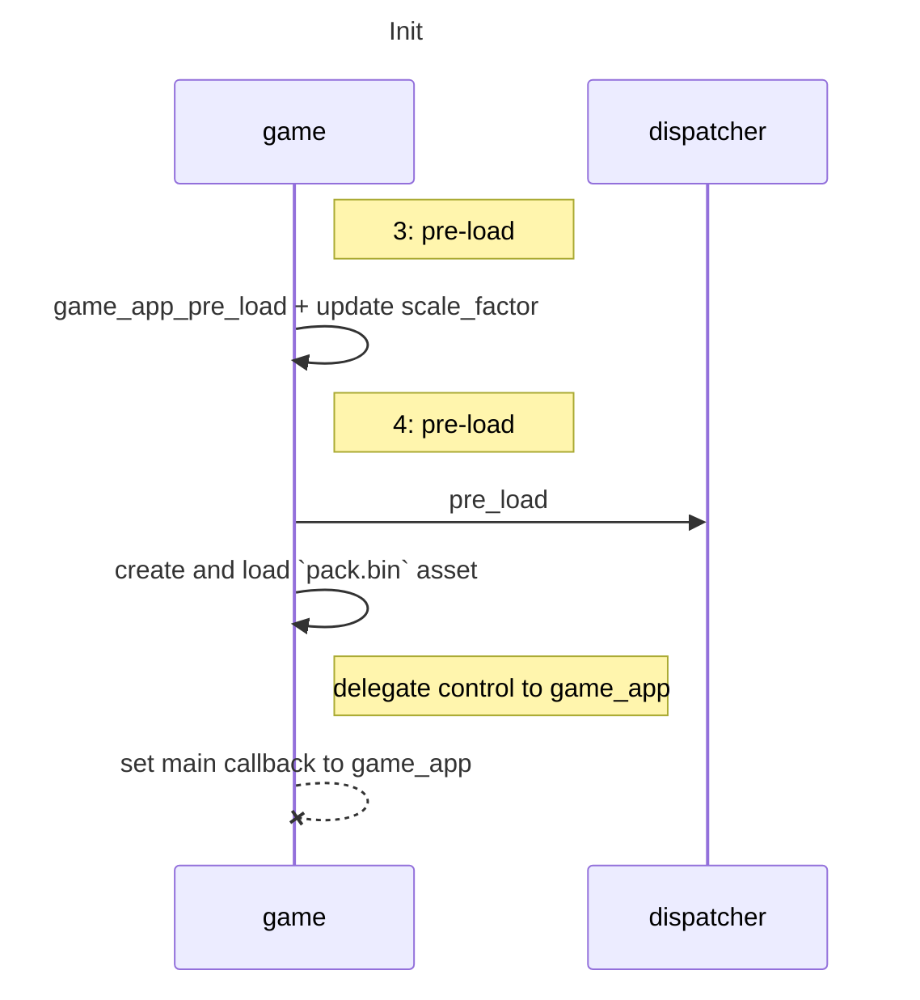
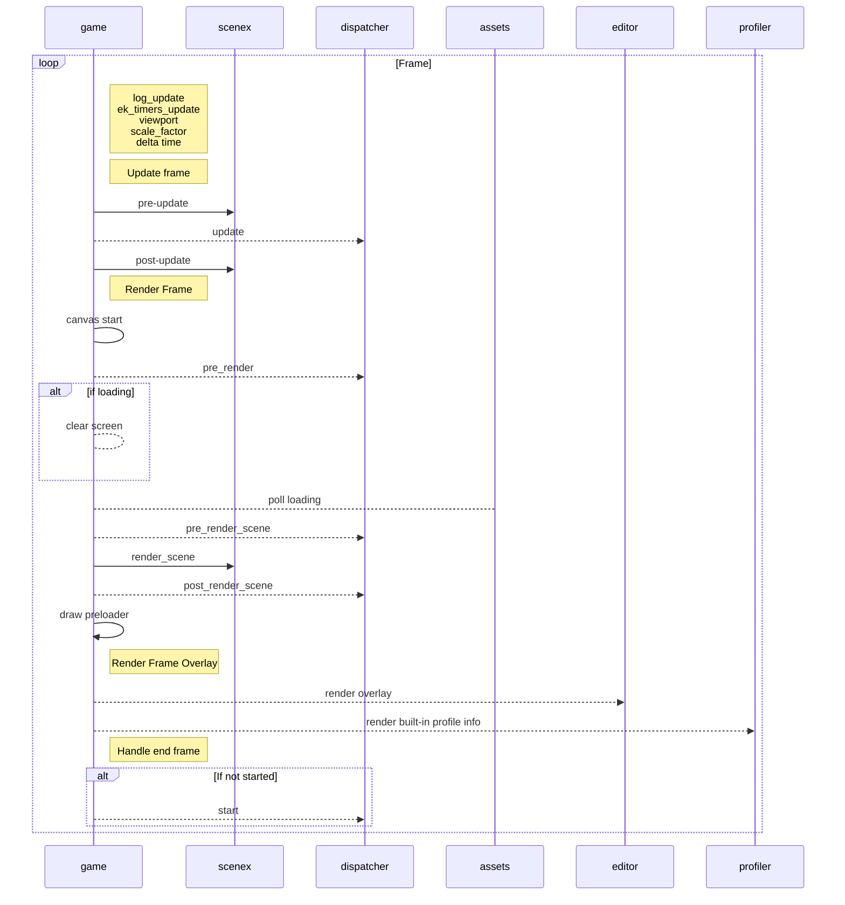

```mermaid

sequenceDiagram
    title Init
    note right of game: 3: pre-load
    game ->> game: game_app_pre_load + update scale_factor
    note right of game: 4: pre-load
    game ->> dispatcher: pre_load
    game ->> game: create and load `pack.bin` asset
    note right of game: delegate control to game_app
    game --x game: set main callback to game_app
```

```mermaid
sequenceDiagram
    loop Frame
        note right of game: log_update<br/> ek_timers_update<br/> viewport<br/> scale_factor<br/> delta time
        
        note right of game: Update frame
        game ->> scenex: pre-update
        game -->> dispatcher: update
        game ->> scenex: post-update
        
        note right of game: Render Frame

        game -> game: canvas start
        game -->> dispatcher: pre_render

        alt if loading
        game --> game: clear screen
        end
        game --> assets: poll loading

        game -->> dispatcher: pre_render_scene
        game ->> scenex: render_scene
        game -->> dispatcher: post_render_scene

        game ->> game: draw preloader

        note right of game: Render Frame Overlay
        game -->> editor: render overlay
        game -->> profiler: render built-in profile info

        note right of game: Handle end frame
        alt If not started
        game -->> dispatcher: start
        end
    end

```